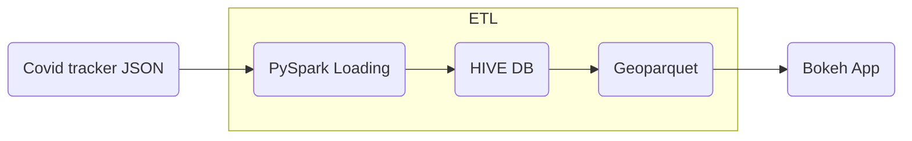

# COVID19 Visualization Project

[**Documentation**](https://caviri.github.io/COVID19/)

## Background

A common way of viewing statistics related to the COVID-19 pandemic has been dashboards. It led to the development of various data sources and programmatic ways of access. However, simply showing data without the underlying context may be misleading. Hence, bringing additional information that helps to understand and interpret data is critical. We would love to see your ideas for building pipelines that fetch data and relevant contextual information.

## Task

Set up a data processing and visualization pipeline for COVID data. You will retrieve the data from a public API (e.g., covidtracking.com), write code to process the data as needed, and provide visualizations of COVID infections over time.Thetask should:

- Allow interactive exploration and interpretation of covid infections in selected countries (e.g., US)
- Deliver a reproducible pipeline that re-executes automatically
- Provide a clean and well-documented code

## Format

Present your work in a well-documented repository, such as GitHub, GitLab, or RenkuLab.Resources

- Data API:https://covidtracking.com/data/api/version-2
- Create A Data Pipeline based on Messaging Using PySpark Hive:https://www.projectpro.io/project-use-case/build-a-data-pipeline-based-on-messaging-using-spark-and-hive

## Devnotes

They are gonna care about:

- Meaningful README
- FAIR principles (Findable, Accessible, Interoperable, Reusable)
- Reproducible research
- Good coding practices

### README

Here there should be information to understand what kind of data are we fetching. Information about how to deploy the app. What kind of dependencies are needed. Information about the coverage. A license. 

### FAIR

Docker container. Backup of the data requested. DOI in zenodo. A good documentation based on sphynx. Object orriented method so functions can be reused. 

### Reproducibility

Docker container. Heroku app. Unittest on the code. 

### Good coding practices

Type based programming. Tests. Inline documentation. Codestyle. Convention in the name of the variables. 

### Technologies

These technologies are mentioned on the pyproject page. 


- NiFi: Apache NiFi is a software project from the Apache Software Foundation designed to automate the flow of data between software systems. Real time streaming data import from external API using NiFi

- PySpark: Apache Spark is an open-source unified analytics engine for large-scale data processing. Spark provides an interface for programming clusters with implicit data parallelism and fault tolerance.

- HDFS:The Hadoop Distributed File System (HDFS) is a distributed file system designed to run on commodity hardware. It has many similarities with existing distributed file systems. However, the differences from other distributed file systems are significant. HDFS is highly fault-tolerant and is designed to be deployed on low-cost hardware. HDFS provides high throughput access to application data and is suitable for applications that have large data sets. 

- Kafka: Apache Kafka is a distributed event store and stream-processing platform. It is an open-source system developed by the Apache Software Foundation written in Java and Scala. The project aims to provide a unified, high-throughput, low-latency platform for handling real-time data feeds

- Airflow: Apache Airflow is an open-source workflow management platform for data engineering pipelines

- Tableau: Tableau Software is an American interactive data visualization software company

- AWS QuickSight: Amazon QuickSight allows everyone in your organization to understand your data by asking questions in natural language, exploring through interactive dashboards, or automatically looking for patterns and outliers powered by machine learning.

- streamz: Streamz helps you build pipelines to manage continuous streams of data. It is simple to use in simple cases, but also supports complex pipelines that involve branching, joining, flow control, feedback, back pressure, and so on.


#### PySpark

PySpark is a great language for performing exploratory data analysis at scale, building machine learning pipelines, and creating ETLs for a data platform. If you’re already familiar with Python and libraries such as Pandas, then PySpark is a great language to learn in order to create more scalable analyses and pipelines.


#### Hive

Hive is an ETL and Data warehousing tool developed on top of the Hadoop Distributed File System. To begin with, in Hive, tables and databases could be created beforehand and then you can load data into them. 

### Database

The Covid Tracking Project: Data API. It contains 2 main categories: National Data, and State & Territories Data.  

#### National Data

- Historic US values: 
    - field_definitions
        - Total test results
        - Hospital discharges
        - Confirmed Cases
        - Cumulative hospitalized/Ever hospitalized
        - Cumulative in ICU/Ever in ICU
        - Cumulative on ventilator/Ever on ventilator
        - Currently hospitalized/Now hospitalized
        - Currently in ICU/Now in ICU
        - Currently on ventilator/Now on ventilator
        - Deaths (probable)
        - Deaths (confirmed)
        - Deaths (confirmed and probable)
        - Probable Cases
        - Last Update (ET)
        - New deaths
        - Date
        - States (**Non reported**)

Every field is organized in 3 categories: cases, testing, and outcomes. Then, every field can be accessed with aq dot after the category. 

- Single Day of data:
    - Same information but you don't need to download the whole dataset. This can be useful in order to make the dataretrieval parallel. 

#### State & Terrtories Data

- All state metadata: Basic information about all states, including notes about our methodology and the websites we use to check for data.
    - field_definitions
        - state_code
        - COVID Tracking Project preferred total test units
        - COVID Tracking Project preferred total test field
        - State population (2019 census)
        - Tertiary source for state COVID data
        - Secondary source for state COVID data
        - Primary source for state COVID data
        - FIPS code
        - State (or territory)

- Single State Metadata: Same but per state
    - field_definitions
        - state_code
        - COVID Tracking Project preferred total test units
        - COVID Tracking Project preferred total test field
        - State population (2019 census)
        - Tertiary source for state COVID data
        - Secondary source for state COVID data
        - Primary source for state COVID data
        - FIPS code
        - State (or territory)

- Historic data for a state or 
    - field_definitions
        - Total test results
        - Hospital discharges
        - Confirmed Cases
        - Cumulative hospitalized/Ever hospitalized
        - Cumulative in ICU/Ever in ICU
        - Cumulative on ventilator/Ever on ventilator
        - Currently hospitalized/Now hospitalized
        - Currently in ICU/Now in ICU
        - Currently on ventilator/Now on ventilator
        - Deaths (probable)
        - Deaths (confirmed)
        - Deaths (confirmed and probable)
        - Probable Cases
        - Last Update (ET)
        - New deaths
        - Date

- Single day of data for a state or territory
    - field_definitions
        - Total test results
        - Hospital discharges
        - Confirmed Cases
        - Cumulative hospitalized/Ever hospitalized
        - Cumulative in ICU/Ever in ICU
        - Cumulative on ventilator/Ever on ventilator
        - Currently hospitalized/Now hospitalized
        - Currently in ICU/Now in ICU
        - Currently on ventilator/Now on ventilator
        - Deaths (probable)
        - Deaths (confirmed)
        - Deaths (confirmed and probable)
        - Probable Cases
        - Last Update (ET)
        - New deaths
        - Date


### Ideas

- Integrate map with color per variable. 
- Integrate information of events related with measures. Introduce them in the timeline.
- Accelerate the process
- Transforms can include moving average as an example. 

### Dev log

#### 23/10

Strategy A: Creating environment. 

- `python==3.9.13`
- PySpark uses java: `conda install openjdk==17.0.3`
- `conda install pyspark==3.3.0`
- `conda install ipykernel`
- `python -m ipykernel install --user --name covid19`

On windows I have some issues starting the SparkSession. It last forever. 

Strategy B: Docker machine

- `docker pull jupyter/pyspark-notebook`
- `docker run -p 10000:8888 -p 4040:4040 jupyter/pyspark-notebook`

The docker image works fine, and we have access to the dashboard in `localhost:4040`. 

#### 24/10

After checking the db structure, the project initially can be organized as follows:




I found several boilerplates with good templates for data engineering project using PySpark. 

- [PySpark Example Project](https://github.com/AlexIoannides/pyspark-example-project)
- [PySpark Project Template](https://github.com/hbaflast/pyspark-project-template)
- [PySpark Spotify ETL](https://github.com/Amaguk2023/Pyspark_Spotify_ETL)

Following the first example. This seems like a nice project structure to start with: 

```bash
root/
 |-- configs/
 |   |-- etl_config.json
 |-- dependencies/
 |   |-- logging.py
 |   |-- spark.py
 |-- jobs/
 |   |-- etl_job.py
 |-- tests/
 |   |-- test_data/
 |   |-- | -- employees/
 |   |-- | -- employees_report/
 |   |-- test_etl_job.py
 |   build_dependencies.sh
 |   packages.zip
 |   Pipfile
 |   Pipfile.lock
 ```

I achieved to read without issues the scheme of the JSON for daily.json. However, when I try to create a DataFrame out of the json obtained via requests, the parsing of the schema is reduced to the first 2 categories. As a minimum viable proof, I decided to extract manually two vairables `total_cases` and `date` in order to follow with the structure of the project. 

I'm exploring the idea of separate the project into 3 docker containers. One dedicated to the ETL, another to HIVE database, and a third for the interactive bokeh app. In the latter, I want to include 2 kind of visualizations, one map based visualization, and another one for the time series. 


#### 25/10

In order to simplify the development I took the decission to keep the 3 docker idea as a future update and create a simpler version of the workflow. The output from the ETL pipeline will be saved in a parquet (geoparquet) file and this will be picked up by bopkeh in order to do the visualization. 

Ideas for quality control

- Missing values: interpolate values as approximation, or mean value. df.col_name.interpolate df.col_name.fillna
- Missing values: Pyspark solution. pyspark.ml.feature import Imputer. https://www.youtube.com/watch?v=K46pPG8Cepo&ab_channel=WebAgeSolutionsInc
- Data is in incosistent format
- Duplicate records
- Outliers
- Not normalized input data

We can pass the SQL to the parquet.

```python
parqDF.createOrReplaceTempView("ParquetTable")
parkSQL = spark.sql("select * from ParquetTable where salary >= 4000 ")
```

#### 26/10

After dealing with some problems realted to the date/datetime format I got the first MVP of the pipeline. Now data is extracted, dates transformed into a proper datetime type, and data loaded into a parquet db. Bokeh app is able to read this data from the database and plot a simple time-series plot in html. This is the first candidate to the first release. 

Useful links:
- https://crontab.guru/
- https://github.com/AlexIoannides/pyspark-example-project
- https://www.youtube.com/watch?v=nVI4xEH7yU8&ab_channel=Intellipaat
- https://github.com/rvilla87/ETL-PySpark/blob/master/jupyter/ETL.ipynb
- https://github.com/Amaguk2023/Pyspark_Spotify_ETL
- https://github.com/hbaflast/pyspark-project-template
- https://github.com/vivek-bombatkar/Spark-with-Python---My-learning-notes-
- https://github.com/hyunjoonbok/PySpark/blob/master/PySpark%20Dataframe%20Complete%20Guide%20(with%20COVID-19%20Dataset).ipynb
- https://www.databricks.com/glossary/extract-transform-load#:~:text=ETL%2C%20which%20stands%20for%20extract,downstream%20to%20solve%20business%20problems.
- https://www.youtube.com/watch?v=AHMm1wfGuHE&t=1s&ab_channel=TuanVu
- https://www.revisitclass.com/hadoop/how-to-write-a-spark-dataframe-to-hive-table-in-pyspark/
- https://hshirodkar.medium.com/apache-hive-on-docker-4d7280ac6f8e

#### 27/10

I included some exceptions for the API request. Now the database can be overwritten without duplicates issues. And I added another transformation: Rolling Mean. Now I will include some tests with a small dataset of those transformations for the unittest. 

Test working correctly for one transformation. Now tests needs to be generated for every transformation. 

Application running smoothly with `python -m covid19_project` but some warnings appeared:

```python
/usr/local/spark/python/pyspark/sql/pandas/conversion.py:474: FutureWarning: iteritems is deprecated and will be removed in a future version. Use .items instead.
  for column, series in pdf.iteritems():
/usr/local/spark/python/pyspark/sql/pandas/conversion.py:486: FutureWarning: iteritems is deprecated and will be removed in a future version. Use .items instead.
  for column, series in pdf.iteritems():
/usr/local/spark/python/pyspark/pandas/utils.py:975: PandasAPIOnSparkAdviceWarning: If `index_col` is not specified for `to_spark`, the existing index is lost when converting to Spark DataFrame.
  warnings.warn(message, PandasAPIOnSparkAdviceWarning)
22/10/27 11:56:22 WARN WindowExec: No Partition Defined for Window operation! Moving all data to a single partition, this can cause serious performance degradation
```

In order to test: `python -m unittest test/test_*.py` 

Still some work is required when using spark-submit with `$SPARK_HOME/bin/spark-submit --master local[*] --files configs/config.json covid19_project/__main__.py` 

#### 28/10

Applying some style corrections with flake8, and configuring correctly the docker container for mybinder. 

### Tutorial

In order to build the docker image: 

```bash
docker build -t COVID19:1.0.0 -f Dockerfile .
```

To run the analysis

```bash
docker run -d --name COVID19 COVID19:1.0.0 python COVID19_project/etl_run.py
```

To run the tests

```bash
docker run -d COVID19 COVID19:1.0.0 python setup.py test
```

## License 

MIT License. 

Copyright (c) 2022 Carlos Vivar Rios

Permission is hereby granted, free of charge, to any person obtaining
a copy of this software and associated documentation files (the
"Software"), to deal in the Software without restriction, including
without limitation the rights to use, copy, modify, merge, publish,
distribute, sublicense, and/or sell copies of the Software, and to
permit persons to whom the Software is furnished to do so, subject to
the following conditions:

The above copyright notice and this permission notice shall be
included in all copies or substantial portions of the Software.

THE SOFTWARE IS PROVIDED "AS IS", WITHOUT WARRANTY OF ANY KIND,
EXPRESS OR IMPLIED, INCLUDING BUT NOT LIMITED TO THE WARRANTIES OF
MERCHANTABILITY, FITNESS FOR A PARTICULAR PURPOSE AND
NONINFRINGEMENT. IN NO EVENT SHALL THE AUTHORS OR COPYRIGHT HOLDERS BE
LIABLE FOR ANY CLAIM, DAMAGES OR OTHER LIABILITY, WHETHER IN AN ACTION
OF CONTRACT, TORT OR OTHERWISE, ARISING FROM, OUT OF OR IN CONNECTION
WITH THE SOFTWARE OR THE USE OR OTHER DEALINGS IN THE SOFTWARE.