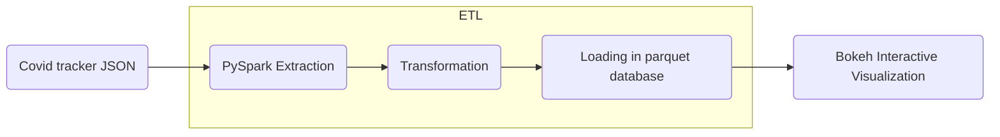

[](https://mybinder.org/v2/gh/caviri/COVID19/HEAD)

# COVID19 Visualization Project

[**Documentation**](https://caviri.github.io/COVID19/)

## Background and task

A common way of viewing statistics related to the COVID-19 pandemic has been dashboards. It led to the development of various data sources and programmatic ways of access. However, simply showing data without the underlying context may be misleading. Hence, bringing additional information that helps to understand and interpret data is critical. We would love to see your ideas for building pipelines that fetch data and relevant contextual information.

Set up a data processing and visualization pipeline for COVID data. You will retrieve the data from a public API (e.g., covidtracking.com), write code to process the data as needed, and provide visualizations of COVID infections over time.Thetask should:

- Allow interactive exploration and interpretation of covid infections in selected countries (e.g., US)
- Deliver a reproducible pipeline that re-executes automatically
- Provide a clean and well-documented code

## Database

The covid tracking project compiled US COVID-19-related data from 02/2022 until 03/2021. It provides data by day and state in three main areas: testing, hospitalization, and patient outcomes. Data is provided via an [API](https://covidtracking.com/data/api/version-2) that can be used to retrieve a `json` file. 

As a proof of concept, this tool takes from that database the total number of COVID-19 cases by day. This metric is accumulative; therefore, if we want to visualize daily COVID-19 cases, we need to transform the original data and calculate the difference. Some US health bureaus reported cases only on weekdays, while others did it uninterrupted daily. This explains why we see a drop in the number of cases during the weekend. To correct this "noise", the tool calculates a rolling mean with a window of 7 days. This transformation smoothes the signal and corrects this artifact; however, it tends to hamper the detection of fast changes in the signal. 

## Solution:

The schema of the solution proposed for this task is represented in the graph below. `PySpark` will be used for the ETL job and `Bokeh` for generating the interactive visualization. Selected data is extracted from the database API. Then, after a data validation checking, several transformations are applied to the data, such as the conversion of dates, calculation of daily differences, and time-series sequence smoothing via rolling mean. Next, data is loaded into a parquet database. This loading process checks for duplicates, and therefore it can be run repeatedly without affecting the database. 



Finally, the data previously loaded in the parquet database is used to generate a bokeh interactive plot in `html`. 


In this proof of concept, I used the total number of COVID-19 cases. However, it can be adapted to any of the metrics available in the API. 

## How to run this project

### Run in MyBinder

The faster way of testing the tool is via Mybinder [here](https://mybinder.org/v2/gh/caviri/COVID19/HEAD). Once the jupyter interface is loaded you can open the terminal and run `python -m COVID19_project`. After some moments the database and the visualization will be stored in the folder `output`.

### Installation of dependencies

Depdendencies can be installed using pip.

```
pip install -r requirements.txt
```

### Run the tool

In order to run the analysis we simply execute the python program. This will create a folder named `output` containing the parquet database and the final html with the interactive visualization.

```
python -m COVID19_project
```

Different parameters can be passed to the tool using the config file in `configs/config.json`. This argument then can be passed to the different transformation methods. This functionality needs to be further developed. 

### Run tests

Each transformation has its corresponding test. It is possible to run them with:


```
python -m unittest tests/test_*.py
```

### Run in docker

It is possible to build a docker container from the dockerfile suministrated in the repository. This docker image is build uppon the jupyter-spark image and it comes with a jupyter lab interface. In order to build the image you can run:
```
docker build caviri/covid19:latest .
```
The in order to run the docker image you need to tunnel the ports. Jupyter uses `8888` port, and the pySpark UI uses `4040` ports.

```
docker run -p 10001:8888 -p 4041:4040 caviri/
```

As an alternative to build your own image it is possible to pull a image from docker hub:

```
docker pull caviri/covid19:latest
``` 

## Project Structure

The structure of the project is inspired from this [repository](https://github.com/AlexIoannides/pyspark-example-project). 

```bash
root/
 |-- configs/
 |   |-- configs.json
 |-- dependencies/
 |   |-- logging.py
 |   |-- spark.py
 |-- COVID19_project/
 |   |-- __main__.py
 |   |-- extract.py
 |   |-- transform.py
 |   |-- load.py
 |   |-- visualize.py
 |-- tests/
 |   |-- test_data/
 |   |-- | -- test_to_date.parquet
 |   |-- | -- ...
 |   |-- test_transform.py
 |   |-- data_generator.py
 |   requirements.txt
 ```

The ETL task and visualization tool are contained in `COVID19_project`. There, each file contains the methods required for each part of the project: extraction, transformation, loading, and visualization. Different parameters can be configured in `configs/configs.json` and then used in transformation methods. Additional modules that support the pySpark session and logging can be found in `dependencies`. Finally, unit test modules are stored in tests next to small representative portions of input and output data. Each of the transformations methods has its own test function.  

## Ideas for further development

### Visualization
- Extract daily cases per state.
- Integrate states databases with their geoboundary in a geoparquet file. 
- Develop a map visualization of US with a colormap depending on the cases. 

### Database
- Implement a Hadoop/HIVE database to test performance. 

### Querying
- Allow custom SQL queries to retrieve information from the database. 

## License 

MIT License. 

Copyright (c) 2022 Carlos Vivar Rios

Permission is hereby granted, free of charge, to any person obtaining
a copy of this software and associated documentation files (the
"Software"), to deal in the Software without restriction, including
without limitation the rights to use, copy, modify, merge, publish,
distribute, sublicense, and/or sell copies of the Software, and to
permit persons to whom the Software is furnished to do so, subject to
the following conditions:

The above copyright notice and this permission notice shall be
included in all copies or substantial portions of the Software.

THE SOFTWARE IS PROVIDED "AS IS", WITHOUT WARRANTY OF ANY KIND,
EXPRESS OR IMPLIED, INCLUDING BUT NOT LIMITED TO THE WARRANTIES OF
MERCHANTABILITY, FITNESS FOR A PARTICULAR PURPOSE AND
NONINFRINGEMENT. IN NO EVENT SHALL THE AUTHORS OR COPYRIGHT HOLDERS BE
LIABLE FOR ANY CLAIM, DAMAGES OR OTHER LIABILITY, WHETHER IN AN ACTION
OF CONTRACT, TORT OR OTHERWISE, ARISING FROM, OUT OF OR IN CONNECTION
WITH THE SOFTWARE OR THE USE OR OTHER DEALINGS IN THE SOFTWARE.
