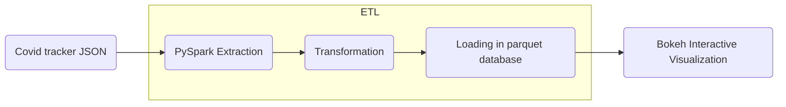

[](https://mybinder.org/v2/gh/caviri/COVID19/HEAD)

# COVID19 Visualization Project

[**Documentation**](https://caviri.github.io/COVID19/)

## Background and task

A common way of viewing statistics related to the COVID-19 pandemic has been dashboards. It led to the development of various data sources and programmatic ways of access. However, simply showing data without the underlying context may be misleading. Hence, bringing additional information that helps to understand and interpret data is critical. We would love to see your ideas for building pipelines that fetch data and relevant contextual information.

Set up a data processing and visualization pipeline for COVID data. You will retrieve the data from a public API (e.g., covidtracking.com), write code to process the data as needed, and provide visualizations of COVID infections over time.Thetask should:

- Allow interactive exploration and interpretation of covid infections in selected countries (e.g., US)
- Deliver a reproducible pipeline that re-executes automatically
- Provide a clean and well-documented code

## Database

- Data API:https://covidtracking.com/data/api/version-2

## Solution:



## Output


## How to run this project

### Run in MyBinder

The faster way of testing the tool is via Mybinder [here](https://mybinder.org/v2/gh/caviri/COVID19/HEAD). Once the jupyter interface is loaded you can open the terminal and run `python -m COVID19_project`. After some moments the database and the visualization will be stored in the folder `output`.

### Installation of dependencies

Depdendencies can be installed using pip.

```
pip install -r requirements.txt
```

### Run the tool

In order to run the analysis we simply execute the python program. This will create a folder named `output` containing the parquet database and the final html with the interactive visualization.

```
python -m COVID19_project
```

### Run tests

Each transformation has its corresponding test. It is possible to run them with:


```
python -m unittest tests/test_*.py
```

### Run in docker

It is possible to build a docker container from the dockerfile suministrated in the repository. This docker image is build uppon the jupyter-spark image and it comes with a jupyter lab interface. In order to build the image you can run:
```
docker build caviri/covid19:latest .
```
The in order to run the docker image you need to tunnel the ports. Jupyter uses `8888` port, and the pySpark UI uses `4040` ports.

```
docker run -p 10001:8888 -p 4041:4040 caviri/
```

As an alternative to build your own image it is possible to pull a image from docker hub:

```
docker pull caviri/covid19:latest
``` 

## Structure of the project

```bash
root/
 |-- configs/
 |   |-- configs.json
 |-- dependencies/
 |   |-- logging.py
 |   |-- spark.py
 |-- COVID19_project/
 |   |-- __main__.py
 |   |-- extract.py
 |   |-- transform.py
 |   |-- load.py
 |   |-- visualize.py
 |-- tests/
 |   |-- test_data/
 |   |-- | -- test_to_date.parquet
 |   |-- | -- ...
 |   |-- test_transform.py
 |   |-- data_generator.py
 |   requirements.txt
 ```


## License 

MIT License. 

Copyright (c) 2022 Carlos Vivar Rios

Permission is hereby granted, free of charge, to any person obtaining
a copy of this software and associated documentation files (the
"Software"), to deal in the Software without restriction, including
without limitation the rights to use, copy, modify, merge, publish,
distribute, sublicense, and/or sell copies of the Software, and to
permit persons to whom the Software is furnished to do so, subject to
the following conditions:

The above copyright notice and this permission notice shall be
included in all copies or substantial portions of the Software.

THE SOFTWARE IS PROVIDED "AS IS", WITHOUT WARRANTY OF ANY KIND,
EXPRESS OR IMPLIED, INCLUDING BUT NOT LIMITED TO THE WARRANTIES OF
MERCHANTABILITY, FITNESS FOR A PARTICULAR PURPOSE AND
NONINFRINGEMENT. IN NO EVENT SHALL THE AUTHORS OR COPYRIGHT HOLDERS BE
LIABLE FOR ANY CLAIM, DAMAGES OR OTHER LIABILITY, WHETHER IN AN ACTION
OF CONTRACT, TORT OR OTHERWISE, ARISING FROM, OUT OF OR IN CONNECTION
WITH THE SOFTWARE OR THE USE OR OTHER DEALINGS IN THE SOFTWARE.
